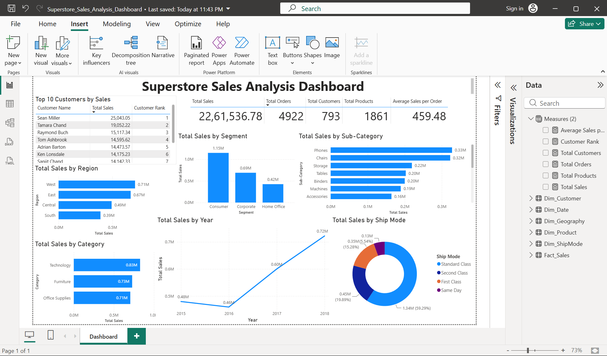

# Superstore Sales Analysis Dashboard

## Project Overview

This project analyzes Superstore sales data using **Excel, SQL, and Power BI**. The objective of this project is to identify sales performance across regions, categories, customer segments, sub-categories, shipping modes, products, and customers.

The project includes data cleaning, SQL analysis, Power BI star schema modeling, DAX measures, dashboard creation, and business insight generation.

---

## Business Problem

Retail businesses need to understand which regions, product categories, customer segments, shipping modes, and customers are contributing the most to sales. Without proper analysis, it becomes difficult to identify high-performing areas, low-performing regions, top customers, and important sales trends.

The objective of this project is to analyze Superstore sales data and generate business insights that can help improve sales performance, customer targeting, product focus, and regional decision-making.

---

## Dashboard Preview



---

## Project Files

| File Name                                                                                  | Description                               |
| ------------------------------------------------------------------------------------------ | ----------------------------------------- |
| [Superstore_Sales_Analysis_Dashboard.pbix](Superstore_Sales_Analysis_Dashboard.pbix)       | Power BI dashboard file                   |
| [Superstore_Analysis_sql.ipynb](Superstore_Analysis_sql.ipynb)                             | SQL analysis notebook                     |
| [Superstore_Analysis_With_Dashboard.xlsx](Superstore_Analysis_With_Dashboard.xlsx)         | Cleaned Excel dataset and Excel dashboard |
| [dashboard-screenshot.png](dashboard-screenshot.png)                                       | Power BI dashboard screenshot             |
| [superstore-sales-analysis-final-report.pdf](superstore-sales-analysis-final-report.pdf)   | Final project report                      |
| [superstore-sales-analysis-final-report.docx](superstore-sales-analysis-final-report.docx) | Editable project report                   |
| [README.md](README.md)                                                                     | Project documentation                     |

---

## Tools Used

* Microsoft Excel
* Google Colab
* SQLite
* SQL
* Power BI Desktop
* Power Query
* DAX
* GitHub

---

## Dataset Information

The dataset contains Superstore sales records.

## Dataset Source / Credit

The dataset used in this project was taken from Kaggle.

**Dataset Name:** [Superstore Sales Dataset](https://www.kaggle.com/datasets/rohitsahoo/sales-forecasting)
**Source:** Kaggle

Credit goes to the original dataset uploader/owner on Kaggle. This project is created only for learning, portfolio building, and data analysis practice.

### Dataset Size

| Metric        | Value |
| ------------- | ----: |
| Total Rows    | 9,800 |
| Total Columns |    18 |

### Columns Used

* Row ID
* Order ID
* Order Date
* Ship Date
* Ship Mode
* Customer ID
* Customer Name
* Segment
* Country
* City
* State
* Postal Code
* Region
* Product ID
* Category
* Sub-Category
* Product Name
* Sales

---

## Data Cleaning and Preparation

The dataset was cleaned and prepared before analysis.

The main steps included:

* Checked dataset shape and column names
* Verified total rows and columns
* Checked and corrected date columns
* Used Excel Pivot Tables for result validation
* Loaded the cleaned dataset into Google Colab
* Created an SQLite database for SQL analysis
* Imported the dataset into Power BI Desktop
* Created a star schema model in Power BI
* Created DAX measures for dashboard KPIs

---

## Power BI Data Model

A star schema was created in Power BI for better reporting and performance.

### Fact Table

#### Fact_Sales

The fact table contains transaction-level sales data.

Columns used:

* Row ID
* Order ID
* Order Date
* Ship Date
* Ship Mode
* Customer ID
* Product ID
* Country
* City
* State
* Postal Code
* Region
* Sales
* GeoKey

---

### Dimension Tables

#### Dim_Customer

| Column        |
| ------------- |
| Customer ID   |
| Customer Name |
| Segment       |

#### Dim_Product

| Column       |
| ------------ |
| Product ID   |
| Product Name |
| Category     |
| Sub-Category |

#### Dim_Geography

| Column      |
| ----------- |
| Country     |
| City        |
| State       |
| Postal Code |
| Region      |
| GeoKey      |

#### Dim_ShipMode

| Column    |
| --------- |
| Ship Mode |

#### Dim_Date

| Column     |
| ---------- |
| Date       |
| Year       |
| Month      |
| Month Name |

---

## Power BI Relationships

| Dimension Table           | Fact Table              | Relationship |
| ------------------------- | ----------------------- | ------------ |
| Dim_Customer[Customer ID] | Fact_Sales[Customer ID] | One-to-Many  |
| Dim_Product[Product ID]   | Fact_Sales[Product ID]  | One-to-Many  |
| Dim_ShipMode[Ship Mode]   | Fact_Sales[Ship Mode]   | One-to-Many  |
| Dim_Date[Date]            | Fact_Sales[Order Date]  | One-to-Many  |
| Dim_Geography[GeoKey]     | Fact_Sales[GeoKey]      | One-to-Many  |

Cross filter direction was kept as **Single**.

---

## DAX Measures

```DAX
Total Sales = SUM(Fact_Sales[Sales])
```

```DAX
Total Orders = DISTINCTCOUNT(Fact_Sales[Order ID])
```

```DAX
Total Customers = DISTINCTCOUNT(Fact_Sales[Customer ID])
```

```DAX
Total Products = DISTINCTCOUNT(Fact_Sales[Product ID])
```

```DAX
Average Sales per Order = DIVIDE([Total Sales], [Total Orders])
```

```DAX
Customer Rank =
RANKX(
    ALL(Dim_Customer[Customer Name]),
    [Total Sales],
    ,
    DESC
)
```

---

## Dashboard Visuals

The Power BI dashboard includes:

* KPI table
* Total Sales by Region
* Total Sales by Category
* Total Sales by Segment
* Total Sales by Year
* Total Sales by Sub-Category
* Total Sales by Ship Mode
* Top Customers by Sales

---

## Key Performance Indicators

| KPI                     |        Value |
| ----------------------- | -----------: |
| Total Sales             | 2,261,536.78 |
| Total Orders            |        4,922 |
| Total Customers         |          793 |
| Total Products          |        1,861 |
| Average Sales per Order |       459.48 |

---

## Business Insights

### 1. Region Performance

| Region  | Total Sales |
| ------- | ----------: |
| West    |  710,219.68 |
| East    |  669,518.73 |
| Central |  492,646.91 |
| South   |  389,151.46 |

**Insight:** West is the best-performing region, while South has the lowest sales.

---

### 2. Category Performance

| Category        | Total Sales |
| --------------- | ----------: |
| Technology      |  827,455.87 |
| Furniture       |  728,658.58 |
| Office Supplies |  705,422.33 |

**Insight:** Technology generated the highest sales among all categories.

---

### 3. Segment Performance

| Segment     |  Total Sales |
| ----------- | -----------: |
| Consumer    | 1,148,060.53 |
| Corporate   |   688,494.07 |
| Home Office |   424,982.18 |

**Insight:** The Consumer segment is the highest revenue-generating customer segment.

---

### 4. Sub-Category Performance

| Sub-Category | Total Sales |
| ------------ | ----------: |
| Phones       |  327,782.45 |
| Chairs       |  322,822.73 |
| Storage      |  219,343.39 |
| Tables       |  202,810.63 |
| Binders      |  200,028.79 |

**Insight:** Phones and Chairs are the top-performing sub-categories.

---

### 5. Ship Mode Performance

| Ship Mode      |  Total Sales |
| -------------- | -----------: |
| Standard Class | 1,340,831.31 |
| Second Class   |   449,914.18 |
| First Class    |   345,572.26 |
| Same Day       |   125,219.04 |

**Insight:** Standard Class is the most used and highest revenue-generating shipping mode.

---

### 6. Top Customers

| Customer Name | Total Sales |
| ------------- | ----------: |
| Sean Miller   |   25,043.05 |
| Tamara Chand  |   19,052.22 |
| Raymond Buch  |   15,117.34 |
| Tom Ashbrook  |   14,595.62 |
| Adrian Barton |   14,473.57 |

**Insight:** Sean Miller is the highest-value customer. However, his contribution is only around 1.11% of total sales, showing that revenue is distributed across many customers.

---

## SQL Analysis

SQL analysis was performed in **Google Colab** using **SQLite**.

### Python Setup

```python
from google.colab import files
uploaded = files.upload()
```

```python
import pandas as pd
import sqlite3

file_name = list(uploaded.keys())[0]
df = pd.read_excel(file_name, sheet_name='Dataset')

conn = sqlite3.connect(':memory:')
df.to_sql('superstore', conn, index=False, if_exists='replace')

df.head()
```

```python
print("Shape:", df.shape)
print("\nColumns:")
for col in df.columns:
    print(col)
```

---

## SQL Queries and Results

### 1. Total Sales

```sql
SELECT 
    ROUND(SUM(Sales), 2) AS Total_Sales
FROM superstore;
```

Result:

|  Total Sales |
| -----------: |
| 2,261,536.78 |

---

### 2. Total Orders

```sql
SELECT 
    COUNT(DISTINCT "Order ID") AS Total_Orders
FROM superstore;
```

Result:

| Total Orders |
| -----------: |
|        4,922 |

---

### 3. Total Customers

```sql
SELECT 
    COUNT(DISTINCT "Customer ID") AS Total_Customers
FROM superstore;
```

Result:

| Total Customers |
| --------------: |
|             793 |

---

### 4. Sales by Region

```sql
SELECT 
    Region,
    ROUND(SUM(Sales), 2) AS Total_Sales
FROM superstore
GROUP BY Region
ORDER BY Total_Sales DESC;
```

Result:

| Region  | Total Sales |
| ------- | ----------: |
| West    |  710,219.68 |
| East    |  669,518.73 |
| Central |  492,646.91 |
| South   |  389,151.46 |

---

### 5. Sales by Category

```sql
SELECT 
    Category,
    ROUND(SUM(Sales), 2) AS Total_Sales
FROM superstore
GROUP BY Category
ORDER BY Total_Sales DESC;
```

Result:

| Category        | Total Sales |
| --------------- | ----------: |
| Technology      |  827,455.87 |
| Furniture       |  728,658.58 |
| Office Supplies |  705,422.33 |

---

### 6. Sales by Segment

```sql
SELECT 
    Segment,
    ROUND(SUM(Sales), 2) AS Total_Sales
FROM superstore
GROUP BY Segment
ORDER BY Total_Sales DESC;
```

Result:

| Segment     |  Total Sales |
| ----------- | -----------: |
| Consumer    | 1,148,060.53 |
| Corporate   |   688,494.07 |
| Home Office |   424,982.18 |

---

### 7. Sales by Sub-Category

```sql
SELECT 
    "Sub-Category",
    ROUND(SUM(Sales), 2) AS Total_Sales
FROM superstore
GROUP BY "Sub-Category"
ORDER BY Total_Sales DESC;
```

Result:

| Sub-Category | Total Sales |
| ------------ | ----------: |
| Phones       |  327,782.45 |
| Chairs       |  322,822.73 |
| Storage      |  219,343.39 |
| Tables       |  202,810.63 |
| Binders      |  200,028.79 |
| Machines     |  189,238.63 |
| Accessories  |  164,186.70 |
| Copiers      |  146,248.09 |
| Bookcases    |  113,813.20 |
| Appliances   |  104,618.40 |

---

### 8. Monthly Sales Trend

```sql
SELECT 
    strftime('%Y-%m', "Order Date") AS Order_Month,
    ROUND(SUM(Sales), 2) AS Total_Sales
FROM superstore
GROUP BY Order_Month
ORDER BY Order_Month;
```

Purpose: This query was used to analyze monthly sales movement over time.

---

### 9. Top 10 Customers by Sales

```sql
SELECT 
    "Customer ID",
    "Customer Name",
    ROUND(SUM(Sales), 2) AS Total_Sales
FROM superstore
GROUP BY "Customer ID", "Customer Name"
ORDER BY Total_Sales DESC
LIMIT 10;
```

Result:

| Customer ID | Customer Name      | Total Sales |
| ----------- | ------------------ | ----------: |
| SM-20320    | Sean Miller        |   25,043.05 |
| TC-20980    | Tamara Chand       |   19,052.22 |
| RB-19360    | Raymond Buch       |   15,117.34 |
| TA-21385    | Tom Ashbrook       |   14,595.62 |
| AB-10105    | Adrian Barton      |   14,473.57 |
| KL-16645    | Ken Lonsdale       |   14,175.23 |
| SC-20095    | Sanjit Chand       |   14,142.33 |
| HL-15040    | Hunter Lopez       |   12,873.30 |
| SE-20110    | Sanjit Engle       |   12,209.44 |
| CC-12370    | Christopher Conant |   12,129.07 |

---

### 10. Customer Ranking using RANK()

```sql
SELECT 
    "Customer ID",
    "Customer Name",
    ROUND(SUM(Sales), 2) AS Total_Sales,
    RANK() OVER(
        ORDER BY SUM(Sales) DESC
    ) AS Customer_Rank
FROM superstore
GROUP BY "Customer ID", "Customer Name"
ORDER BY Customer_Rank
LIMIT 10;
```

Purpose: This query ranks customers based on total sales using the SQL window function `RANK()`.

---

### 11. Top Customer by Region using CTE and ROW_NUMBER()

```sql
WITH customer_region_sales AS (
    SELECT 
        Region,
        "Customer ID",
        "Customer Name",
        ROUND(SUM(Sales), 2) AS Total_Sales
    FROM superstore
    GROUP BY Region, "Customer ID", "Customer Name"
),
ranked_customers AS (
    SELECT 
        Region,
        "Customer ID",
        "Customer Name",
        Total_Sales,
        ROW_NUMBER() OVER(
            PARTITION BY Region
            ORDER BY Total_Sales DESC
        ) AS Region_Customer_Rank
    FROM customer_region_sales
)
SELECT 
    Region,
    "Customer ID",
    "Customer Name",
    Total_Sales
FROM ranked_customers
WHERE Region_Customer_Rank = 1
ORDER BY Region;
```

Result:

| Region  | Customer ID | Customer Name | Total Sales |
| ------- | ----------- | ------------- | ----------: |
| Central | TC-20980    | Tamara Chand  |   18,437.14 |
| East    | TA-21385    | Tom Ashbrook  |   13,723.50 |
| South   | SM-20320    | Sean Miller   |   23,669.20 |
| West    | RB-19360    | Raymond Buch  |   14,345.28 |

---

### 12. Customer Revenue Contribution Percentage

```sql
WITH customer_sales AS (
    SELECT 
        "Customer ID",
        "Customer Name",
        SUM(Sales) AS Total_Sales
    FROM superstore
    GROUP BY "Customer ID", "Customer Name"
)
SELECT 
    "Customer ID",
    "Customer Name",
    ROUND(Total_Sales, 2) AS Total_Sales,
    ROUND(
        Total_Sales * 100.0 / SUM(Total_Sales) OVER(),
        2
    ) AS Contribution_Percentage
FROM customer_sales
ORDER BY Total_Sales DESC
LIMIT 10;
```

Result:

| Customer ID | Customer Name      | Total Sales | Contribution % |
| ----------- | ------------------ | ----------: | -------------: |
| SM-20320    | Sean Miller        |   25,043.05 |           1.11 |
| TC-20980    | Tamara Chand       |   19,052.22 |           0.84 |
| RB-19360    | Raymond Buch       |   15,117.34 |           0.67 |
| TA-21385    | Tom Ashbrook       |   14,595.62 |           0.65 |
| AB-10105    | Adrian Barton      |   14,473.57 |           0.64 |
| KL-16645    | Ken Lonsdale       |   14,175.23 |           0.63 |
| SC-20095    | Sanjit Chand       |   14,142.33 |           0.63 |
| HL-15040    | Hunter Lopez       |   12,873.30 |           0.57 |
| SE-20110    | Sanjit Engle       |   12,209.44 |           0.54 |
| CC-12370    | Christopher Conant |   12,129.07 |           0.54 |

---

### 13. Top 10 Products by Sales

```sql
SELECT 
    "Product ID",
    "Product Name",
    ROUND(SUM(Sales), 2) AS Total_Sales
FROM superstore
GROUP BY "Product ID", "Product Name"
ORDER BY Total_Sales DESC
LIMIT 10;
```

Result:

| Product ID      | Product Name                                               | Total Sales |
| --------------- | ---------------------------------------------------------- | ----------: |
| TEC-CO-10004722 | Canon imageCLASS 2200 Advanced Copier                      |   61,599.82 |
| OFF-BI-10003527 | Fellowes PB500 Electric Punch Plastic Comb Binding Machine |   27,453.38 |
| TEC-MA-10002412 | Cisco TelePresence System EX90 Videoconferencing Unit      |   22,638.48 |
| FUR-CH-10002024 | HON 5400 Series Task Chairs for Big and Tall               |   21,870.58 |
| OFF-BI-10001359 | GBC DocuBind TL300 Electric Binding System                 |   19,823.48 |
| OFF-BI-10000545 | GBC Ibimaster 500 Manual ProClick Binding System           |   19,024.50 |
| TEC-CO-10001449 | Hewlett Packard LaserJet 3310 Copier                       |   18,839.69 |
| TEC-MA-10001127 | HP Designjet T520 Inkjet Large Format Printer              |   18,374.90 |
| OFF-BI-10004995 | GBC DocuBind P400 Electric Binding System                  |   17,965.07 |
| OFF-SU-10000151 | High Speed Automatic Electric Letter Opener                |   17,030.31 |

---

### 14. Sales by Ship Mode

```sql
SELECT 
    "Ship Mode",
    ROUND(SUM(Sales), 2) AS Total_Sales
FROM superstore
GROUP BY "Ship Mode"
ORDER BY Total_Sales DESC;
```

Result:

| Ship Mode      |  Total Sales |
| -------------- | -----------: |
| Standard Class | 1,340,831.31 |
| Second Class   |   449,914.18 |
| First Class    |   345,572.26 |
| Same Day       |   125,219.04 |

---

## Final Conclusion

The Superstore Sales Analysis shows total sales of **2,261,536.78** from **4,922 orders**, **793 customers**, and **1,861 products**.

The **West region** is the highest-performing region, while **Technology** is the top-performing product category. The **Consumer segment** contributes the highest revenue among all customer segments. At the sub-category level, **Phones** and **Chairs** generated the highest sales. **Standard Class** is the dominant shipping mode. The highest-value customer is **Sean Miller**, but his contribution is only around **1.11%** of total sales.

This shows that revenue is distributed across many customers and the business is not heavily dependent on a single customer.

---

## Skills Demonstrated

* Excel Data Cleaning
* Pivot Table Validation
* SQL Aggregation
* SQL Window Functions
* CTEs
* Ranking Analysis
* Revenue Contribution Analysis
* Power Query Transformation
* Star Schema Data Modeling
* DAX Measures
* Power BI Dashboard Design
* Business Insight Generation
* GitHub Documentation

---

## Project Status

Completed.

---

## Author

**Shubham Kumar Dubey**
Aspiring Data Analyst skilled in Excel, SQL, Power BI, Power Query, DAX, and dashboard reporting.

**GitHub:** [shubham-dubee](https://github.com/shubham-dubee)
**LinkedIn:** [shubham-kumar-dubey](https://www.linkedin.com/in/shubham-kumar-dubey-34b1b33b1)
